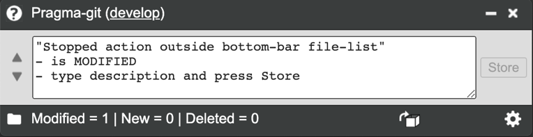

Pragma-git
==========

 

"Pragma-git" is the friendly pragmatic git control app, fully compatible with
other git client softwares.

The difference to other git clients are:

-   small window — leaves more screen-space without hiding program

-   easy overview — you don’t need the branch diagrams in daily work

-   shows features when applicable — do not show a button when it cannot be used

-   uses external diff and merge tools — use your favourite

The aim is to be :

-   ”pragmatic”, the antonym (opposite) to how many non-experts perceive ”git”
    as "impractical, irrational, unreasonable, inefficient”

 

Screen shot
-----------

Example screen shot with the stash function enabled.

 

 

 

Requirements
------------

-   [Windows, Mac or Linux](https://github.com/nwjs/nw.js/wiki/Window)

-   [​nw.js (binary download includes everything
    needed)](https://github.com/nwjs/nw.js/wiki/Frameless-Window)
