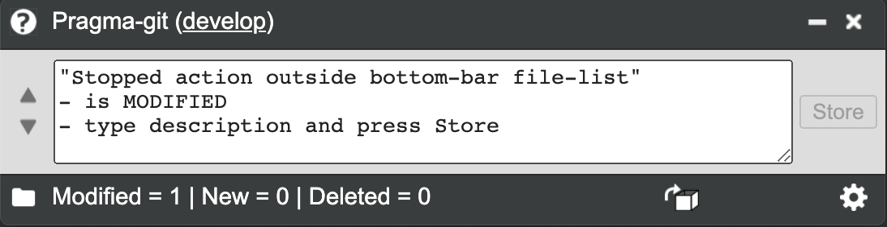

Pragma-git
==========

 

"Pragma-git" is the friendly pragmatic git control app, *fully compatible* with
other git client softwares.

The difference to other git clients are:

-   small window — leaves more screen-space without hiding program

-   easy overview — you don’t need the branch diagrams in daily work

-   shows git functions only when applicable — no confusion

-   uses external diff and merge tools — use your favourite

-   note taking for each repository

 

Git is an impressive toolbox with over 100 commands, and knowing what commands
to use makes the threshold to get started overwhelming.

 

The aim with Pragma-git is to be

-   ”pragmatic” — the antonym (opposite) to impractical, irrational, or
    unreasonable.

-   just right — making the best features of git easy to use

-   watching out — guiding you through dangers of losing data

 

Screen shot
-----------

Example screen shot with all the functions enabled (most of the time when not
applicable, many of these will be hidden)

Installation
------------

-   Windows / Mac — download and run installer

-   Linux — download deb or rpm installer. Try to double-click and run.  
    If that is not allowed :

    -   Ubuntu, Linux Mint, etc (deb-format) :  
        `sudo dpkg --install INSTALLATION_FILE`

    -   RedHat, CentOS, Fedora etc (rpm-format) :  
        `sudo yum localinstall  INSTALLATION_FILE`

     

 
